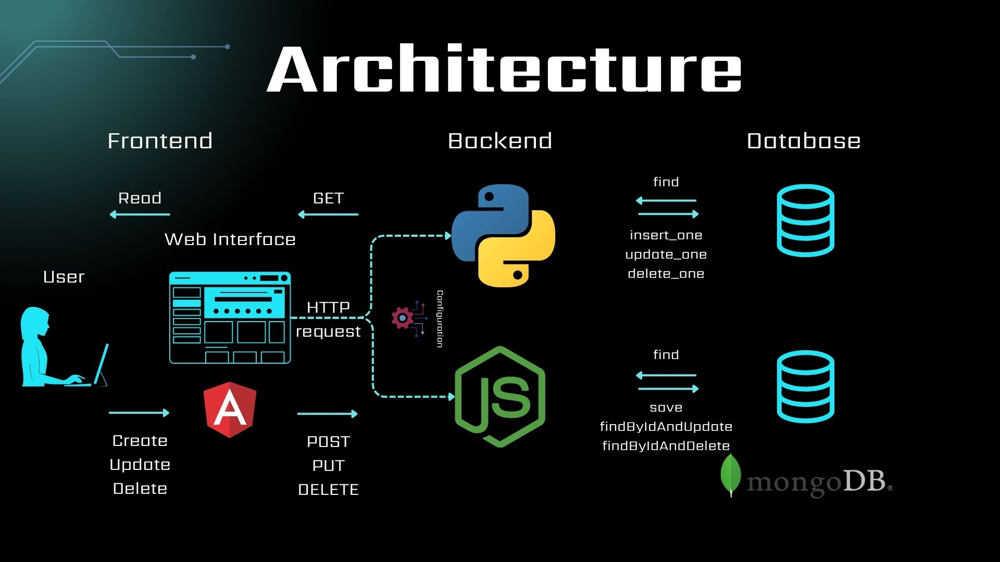

# User Management Web Application (MEAN Stack)

This project is a user management application, built using **Angular** for the frontend, **FastAPI** or **Node.js** for the backend, and **MongoDB** for data storage. The application allows users to perform CRUD (Create, Read, Update, Delete) operations.

## Features
- Add a new user
- Display the list of users
- Update user information
- Delete a user

<div style="text-align: center;">
    
</div>

---

## Getting Started

### Prerequisites
Make sure you have the following requirements:
- [Python](http://python.org/downloads/)
- [Node.js](https://nodejs.org/en/download)
- [Angular CLI](https://angular.dev/tools/cli)
- [MongoDB Atlas Cluster](https://www.mongodb.com/) (The **free** cluster configuration is sufficient for this project)

### Installation
1. Clone the repository:
    ```bash
    git clone https://github.com/Lahdhirim/user_management_web_app.git
    cd user_management_service_web_app
    ```
2. Install the requirements:
    - For **FastAPI**:
        ```bash
        cd backend_fast_api
        pip install -r requirements.txt
        ```
    - For **Node.js**:
        ```bash
        cd backend_nodejs
        npm install
        ```
    - For **Angular**:
        ```bash
        cd frontend
        npm install
        ```
### Running the application:
- After creating the cluster in MongoDB Atlas, create *.env* file in the main directory following the [`.env.example`](.env.example) given. 
Then update the *uri* in the files [`backend_fast_api/configurations.py`](backend_fast_api/configurations.py) and [`backend_nodejs/configurations.js`](backend_nodejs/configurations.js)
- For **Angular with FastAPI backend**:
    ```bash
    cd backend_fast_api
    uvicorn main:app --reload
    cd frontend
    ng serve --open --configuration=fastapi
    ```
    The server will be run on http://127.0.0.1:8000/users

- For **Angular with Node.js backend**:
    ```bash
    cd backend_nodejs
    node server
    cd frontend
    ng serve --open --configuration=nodejs
    ```
    The server will be run on http://127.0.0.1:8001/api/users

Note that if the configuration parameter is not specified, then **FastAPI** is the default backend.

In both cases frontend (Angular) will be accessible at http://localhost:4200 